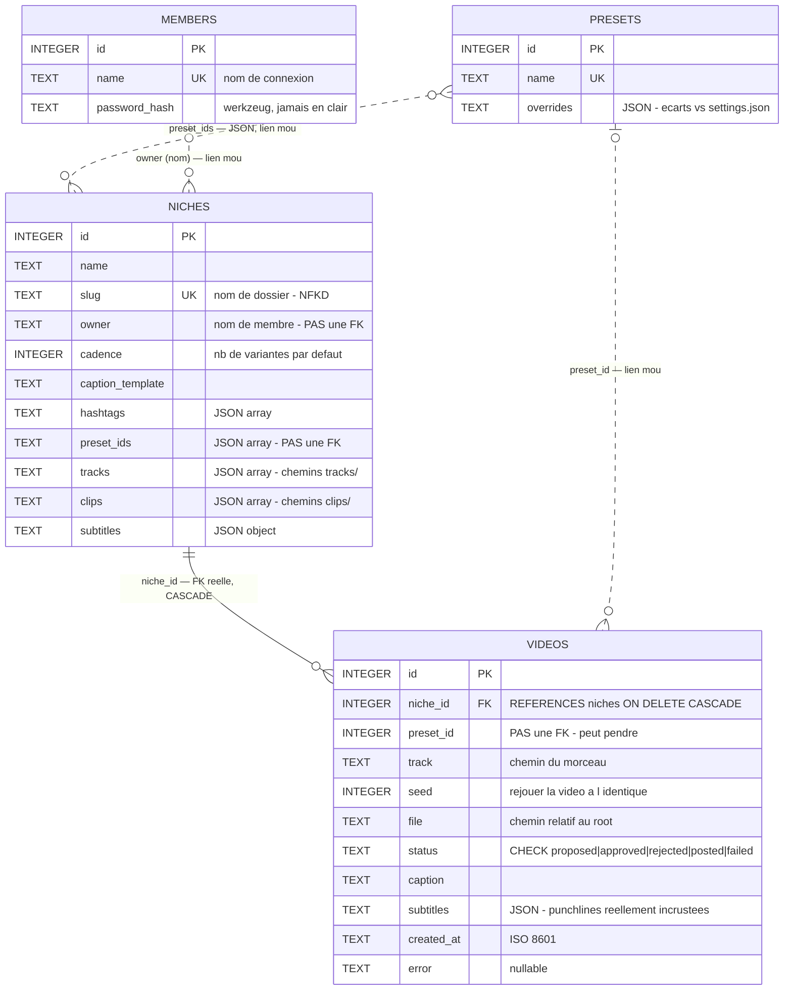
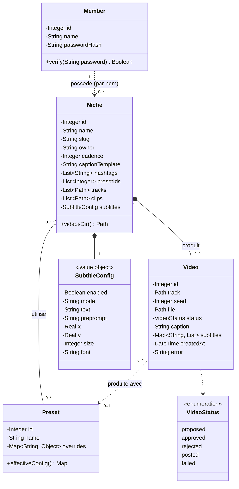

# 08 — db.py

> Persistance SQLite de la plateforme d'équipe · 292 lignes · 23 fonctions
> ← [index des fonctions beatsync](07-index-des-fonctions.md) · → [09 webui.py](09-webui.md)

## Ce que fait ce fichier

Stocker ce que `beatsync.py` ne stocke pas : **qui** travaille, **quels
réglages** sont nommés, **quelles ressources** vont ensemble, **quelles vidéos**
ont été produites.

Une base : `platform.db` (gitignorée). Quatre tables. Aucune dépendance à Flask —
`db.py` s'utilise en CLI, en test, ou depuis `generate_niche.py` sans serveur.

---

## Les 4 tables

```
members ──────────  id, name (UNIQUE), password_hash
                    Le login. Rien d'autre — pas de rôle, pas de permission.

presets ──────────  id, name (UNIQUE), overrides (JSON)
                    Une recette de montage nommée. Ne stocke que les ÉCARTS.

niches ───────────  id, name, slug (UNIQUE), owner, cadence,
                    caption_template, hashtags, preset_ids,
                    tracks, clips, subtitles          ← 5 blobs JSON
                    Le nœud : relie un preset, des sons, des clips, un style.

videos ───────────  id, niche_id (CASCADE), preset_id, track, seed,
                    file, status, caption, subtitles, created_at, error
                    Une ligne par vidéo produite. Le seed permet de rejouer.
```

### Le `CHECK` sur `status` (l.45)

```sql
status TEXT NOT NULL DEFAULT 'proposed'
  CHECK (status IN ('proposed','approved','rejected','posted','failed')),
```

La contrainte est **dans le schéma**, pas seulement dans le code. Un statut
inventé est rejeté par SQLite même si un bug de l'API le laisse passer. La règle
survit au code qui l'utilise.

### `ON DELETE CASCADE` + `PRAGMA foreign_keys = ON` (l.40, l.58)

Supprimer une niche efface ses vidéos en base. **Le PRAGMA est indispensable** :
SQLite désactive les clés étrangères par défaut, et sans lui la cascade serait
déclarée mais inerte. Il est posé dans `connect`, donc sur chaque connexion.

### Pourquoi 5 colonnes JSON dans `niches`

`hashtags`, `preset_ids`, `tracks`, `clips`, `subtitles` sont des listes ou des
dicts. En SQL relationnel pur, ce seraient 5 tables de jointure.

Le choix assumé : ces champs sont **toujours lus en bloc, jamais requêtés**. On
ne cherche jamais « les niches qui contiennent tel clip » — sauf à un endroit
(la suppression d'asset dans `webui.py`), et là un parcours de toutes les niches
suffit largement à cette échelle. Cinq tables de jointure pour ça serait de la
sur-ingénierie.

---

## Les deux diagrammes

Le schéma existe en **deux modèles**, qui ne disent pas la même chose. Les
confondre est la source d'erreur classique.

| | Modèle physique | Modèle conceptuel |
|---|---|---|
| Répond à | *que stocke SQLite ?* | *que manipule le code ?* |
| Notation | entité-association | diagramme de classes UML |
| Types | `TEXT`, `INTEGER`, `REAL` | `String`, `Integer`, `List<T>` |
| Colonnes JSON | une **chaîne** | une **collection** |
| `status` | `TEXT` + contrainte `CHECK` | une **énumération** |
| Sert à | écrire du SQL, migrer, déboguer | expliquer le métier, faire évoluer |
| Fichier PlantUML | `schema-db.puml` | `schema-db-uml.puml` |

### Pourquoi `TEXT` et pas `String`

Dans le modèle physique, `TEXT` n'est pas une approximation : c'est le nom exact
du type. **SQLite n'a que cinq classes de stockage** — `NULL`, `INTEGER`, `REAL`,
`TEXT`, `BLOB`. Il n'existe ni `String`, ni `VARCHAR`, ni `DATETIME`, ni
`BOOLEAN`. Le `SCHEMA` (l.14) écrit littéralement `name TEXT UNIQUE NOT NULL`.

Écrire `String` dans un modèle physique serait donc faux. Écrire `TEXT` dans un
diagramme de classes UML le serait tout autant — UML est un langage de
modélisation objet, ses types sont conceptuels.

Les deux `.puml` sont dans ce dossier, à coller sur
[planttext.com](https://www.planttext.com/).

---

## Modèle physique — entité-association



### Une seule vraie clé étrangère

C'est le point que le diagramme rend visible et que le `SCHEMA` cache :

| Relation | Déclarée en SQL ? | Conséquence |
|---|---|---|
| `videos.niche_id → niches.id` | **oui**, `REFERENCES … ON DELETE CASCADE` | supprimer une niche efface ses vidéos |
| `videos.preset_id → presets.id` | **non** — simple `INTEGER` | supprimer un preset laisse `preset_id` pointer dans le vide |
| `niches.preset_ids → presets.id` | **non** — tableau JSON | idem, l'id reste dans le JSON |
| `niches.owner → members.name` | **non** — `TEXT`, et par **nom** pas par id | renommer un membre orpheline ses niches |

Les trois liens mous ne sont pas un oubli, mais ils ont un coût réel :

- Supprimer un preset (`DELETE /api/presets/<id>`) **ne nettoie rien**. La niche
  garde son id dans `preset_ids` ; `generate_niche.py` le filtre au chargement
  (`if pid in preset_by_id`, l.66) et l'ignore silencieusement. Si tous les
  presets d'une niche disparaissent, elle génère avec `settings.json` seul.
- `videos.preset_id` sert à l'affichage (« produite avec le preset X »). Un id
  mort donne juste une info manquante, jamais une erreur.
- Comparer les catalogues, c'est le travail de `_delete_asset` dans `webui.py` —
  qui, lui, **nettoie bien** les références `tracks`/`clips` de toutes les niches
  à la suppression d'un asset. Cette cohérence-là est maintenue à la main, en
  Python, faute de FK.

### Les liens qui sortent de la base

Trois colonnes pointent vers le **système de fichiers**, pas vers une table :

```
niches.tracks   ──▶  tracks/<nom>.mp3          (catalogue partagé du label)
niches.clips    ──▶  clips/<nom>.mp4|.jpg      (catalogue partagé du label)
videos.file     ──▶  data/niches/<slug>/videos/<stem>.mp4
```

D'où le champ `exists` calculé à la volée par `/api/state` (`webui.py` l.300) :
la base peut affirmer qu'une vidéo existe alors que le fichier a été supprimé à
la main. Aucune contrainte SQL ne peut le garantir.

---

## Modèle conceptuel — diagramme de classes UML

Ce que le code manipule **après** `_niche_row_to_dict` (l.159) : les blobs JSON
sont redevenus des collections, `status` est un type fermé.



### Ce que cette vue apporte

**Les types sont ceux du code.** `tracks : List<Path>` dit ce que
`generate_niche.py` reçoit vraiment (l.58 : `{Path(c).name for c in niche["clips"]}`).
Le `TEXT` du modèle physique masquait l'itérable.

**`status` est une énumération.** Le `CHECK` de SQLite est une contrainte sur une
chaîne ; conceptuellement c'est un type fermé à 5 valeurs. UML sait le dire,
SQL non.

**Composition ≠ agrégation.** Le losange **plein** `Niche *-- Video` traduit le
`ON DELETE CASCADE` : la vidéo n'existe pas sans sa niche. Le losange **creux**
vers `Preset` dit l'inverse — un preset survit aux niches qui l'utilisent.

**`SubtitleConfig` apparaît**, alors qu'il n'a aucune existence en base (noyé
dans un blob JSON). Le code le traite pourtant comme une structure, et
`coerce_subtitles` (`webui.py` l.120) le valide champ par champ.

### Le modèle en une phrase

> Une **niche** est le point de rencontre : elle relie un ou plusieurs
> **presets** (comment monter), une sélection de **sons** et de **clips** (avec
> quoi monter), un style de **punchlines** (quoi écrire) — et produit des
> **vidéos**, seule entité réellement possédée par elle.

---

## `connect(path)` — l.55

Quatre choses en six lignes :

```python
conn = sqlite3.connect(path)
conn.row_factory = sqlite3.Row      # accès par nom : row["slug"]
conn.execute("PRAGMA foreign_keys = ON")
conn.executescript(SCHEMA)          # CREATE TABLE IF NOT EXISTS
_migrate(conn)
```

`row_factory = sqlite3.Row` permet `row["name"]` au lieu de `row[1]`. Tout le
reste du fichier en dépend.

---

## `_migrate(conn)` — l.72 : le piège du `IF NOT EXISTS`

```python
_ADDED_COLUMNS = {
    "niches": {"tracks": "TEXT NOT NULL DEFAULT '[]'",
               "clips":  "TEXT NOT NULL DEFAULT '[]'"},
}

def _migrate(conn):
    for table, columns in _ADDED_COLUMNS.items():
        existing = {r["name"] for r in conn.execute(f"PRAGMA table_info({table})")}
        for col, decl in columns.items():
            if col not in existing:
                conn.execute(f"ALTER TABLE {table} ADD COLUMN {col} {decl}")
```

**Le problème** : `CREATE TABLE IF NOT EXISTS` ne fait rien si la table existe.
Ajouter une colonne au `SCHEMA` la crée sur une base neuve — et **pas** sur une
base déjà en service. Sur ta machine ça marche, sur la tour de prod la colonne
manque et tout casse.

**La parade** : `PRAGMA table_info` liste les colonnes réelles, on ajoute celles
qui manquent. Idempotent, donc rejouable à chaque connexion sans coût.

`tracks` et `clips` sont là parce qu'ils ont été ajoutés après coup, quand les
catalogues sont devenus partagés. Toute colonne future doit être inscrite dans
`_ADDED_COLUMNS`, pas seulement dans `SCHEMA`.

---

## `slugify(text)` — l.81 · **pure**

```python
text = unicodedata.normalize("NFKD", text).encode("ascii", "ignore").decode()
return re.sub(r"[^a-z0-9]+", "-", text.lower()).strip("-")
```

Le slug devient un **nom de dossier** (`data/niches/<slug>/`). Il doit survivre
à macOS, Windows et Linux.

**La normalisation NFKD** décompose `é` en `e` + accent combinant ; le
`encode("ascii", "ignore")` jette l'accent et garde le `e`. Sans elle,
`"Animé Gym"` perdrait le `é` entièrement (`"anim-gym"`) au lieu de le
translittérer (`"anime-gym"`).

Puis tout ce qui n'est pas alphanumérique devient un tiret, et les tirets de
bord sautent.

Fonction pure, testée directement.

---

## Les membres (l.89-113)

| Fonction | Rôle |
|---|---|
| `add_member(conn, name, password)` | insère avec `generate_password_hash` |
| `set_password(conn, name, password)` | **lève `KeyError`** si `rowcount == 0` |
| `verify_member(conn, name, password)` | `bool(row) and check_password_hash(...)` |
| `list_members(conn)` | noms triés |

### Hachage werkzeug

```python
generate_password_hash(password)   # jamais le mot de passe en clair
check_password_hash(row["password_hash"], password)
```

werkzeug est déjà une dépendance (il vient avec Flask). Salage et algorithme
sont gérés — aucun code de crypto à écrire.

### `set_password` lève, les autres non (l.101)

```python
if cur.rowcount == 0:
    raise KeyError(f"membre inconnu : {name}")
```

Un `UPDATE` sur un nom inexistant réussit silencieusement en SQL. Sans ce test,
`python db.py set-password toto` afficherait « mot de passe mis à jour » sans
rien avoir changé. Le `main()` attrape le `KeyError` et sort en erreur.

### `verify_member` ne distingue pas les deux échecs (l.109)

```python
return bool(row) and check_password_hash(row["password_hash"], password)
```

Membre inconnu et mauvais mot de passe donnent le même `False`. L'API renvoie un
message unique — on n'indique pas à un attaquant quels noms existent.

---

## Les presets (l.116-140)

Quatre fonctions symétriques : `create`, `list`, `update`, `delete`.

```python
json.dumps(overrides, ensure_ascii=False)
```

`ensure_ascii=False` partout : les accents restent lisibles dans la base. Un
`{"caption": "Ça déchire"}` reste `Ça déchire` et pas `Ça déchire`.

`name` est `UNIQUE` → un doublon lève `sqlite3.IntegrityError`, que `webui.py`
convertit en 409.

---

## `effective_config(overrides)` — l.264

```python
def effective_config(overrides: dict) -> dict:
    """DEFAULT_CONFIG ← settings.json ← preset (ordre de la spec)."""
    return merge_settings(load_settings(), overrides)
```

Trois lignes, mais c'est **la règle de composition de tout le projet** :

```
DEFAULT_CONFIG      (beatsync.py, en dur)
      ↓ écrasé par
settings.json       (réglages globaux de l'interface)
      ↓ écrasé par
preset.overrides    (la recette nommée)
```

Un preset ne stocke que ses **écarts**. Changer un défaut global se propage
automatiquement à tous les presets qui ne le surchargent pas.

`db.py` importe `load_settings` et `merge_settings` de `beatsync` — la seule
dépendance entre les deux fichiers, et elle va dans le bon sens (la plateforme
dépend du moteur, jamais l'inverse).

---

## Les niches (l.143-218)

### Les trois helpers de chemin (l.147-156)

```python
def niche_clips_dir(data_root, slug):  return data_root / "niches" / slug / "clips"
def niche_videos_dir(data_root, slug): return data_root / "niches" / slug / "videos"
def niche_links_path(data_root, slug): return data_root / "niches" / slug / "links.txt"
```

**Pures**, et centralisées ici. `generate_niche.py` et `webui.py` les appellent
plutôt que de recomposer les chemins — un seul endroit à changer si
l'arborescence bouge.

`niche_clips_dir` est un vestige de l'époque où chaque niche avait son propre
dossier de clips. Le dossier est encore créé par `create_niche` (l.183), mais le
catalogue est désormais partagé (`clips/` à la racine).

### `_niche_row_to_dict(row)` — l.159 · la frontière

```python
def _niche_row_to_dict(row):
    niche = dict(row)
    for field in NICHE_JSON_FIELDS:
        niche[field] = json.loads(niche[field])
    return niche
```

**Une seule fonction** désérialise les 5 blobs JSON. `get_niche` et
`list_niches` passent tous les deux par elle.

L'invariant qui en découle : dès qu'une niche sort de `db.py`, `tracks` est une
**vraie liste Python**, jamais une chaîne. Aucun appelant n'a à faire de
`json.loads`.

### `update_niche(conn, niche_id, **fields)` — l.198

```python
allowed = {"name", "owner", "cadence", "caption_template",
           "hashtags", "preset_ids", "tracks", "clips", "subtitles"}
updates = {k: v for k, v in fields.items() if k in allowed}
if not updates:
    return
if "cadence" in updates:
    updates["cadence"] = int(updates["cadence"])  # ValueError/TypeError si non numérique
```

Trois défenses :

1. **Liste blanche** — `id` et `slug` ne sont pas modifiables. Le slug est un nom
   de dossier ; le changer orphelinerait les vidéos déjà produites.
2. **`if not updates: return`** — un PATCH vide ne génère pas un `UPDATE SET`
   sans assignation, qui serait une erreur SQL.
3. **`int(cadence)`** — coercion **à la source**. `webui.py` attrape le
   `ValueError` et renvoie 400. Le contrôle est ici, pas dans l'UI, donc il
   protège aussi les appels API directs.

La requête est construite par concaténation de noms de colonnes, mais tous
viennent de `allowed` — pas d'injection possible. Les **valeurs** passent par des
paramètres `?`.

### `delete_niche` : la base seulement (l.216)

Le commentaire dans `webui.py` (l.592) le précise : *fichiers conservés sur
disque*. Supprimer une niche efface ses lignes, pas ses mp4. C'est réversible à
la main — un choix prudent pour une opération irréversible côté UI.

---

## Les vidéos (l.221-261)

| Fonction | Note |
|---|---|
| `create_video(...)` | tout en **keyword-only** (`*`) — 8 paramètres, l'ordre positionnel serait dangereux |
| `list_videos(conn, status=None, niche_id=None)` | filtres optionnels, tri `created_at DESC` |
| `set_video_status(conn, video_id, status, error=None)` | |
| `delete_video(conn, video_id)` | ligne seulement — *le fichier sur disque est géré par l'appelant* |

### Le `WHERE 1=1` (l.235)

```python
query, params = "SELECT * FROM videos WHERE 1=1", []
if status is not None:
    query += " AND status = ?"
```

Astuce classique : `1=1` est toujours vrai, donc chaque filtre optionnel s'ajoute
uniformément avec `AND`. Sans elle, il faudrait savoir si on écrit `WHERE` ou
`AND` selon les filtres déjà posés.

### Pourquoi `delete_video` ne touche pas au fichier

La séparation est explicite dans la docstring. `db.py` ne connaît pas
l'arborescence de l'instance (`root` varie en test). C'est `webui.py` qui
supprime le mp4, **avec sa garde anti-traversal** — la vérification a besoin du
contexte que seul l'appelant possède.

---

## `main()` — l.269 : le CLI

```bash
python db.py add-member <nom>      # demande le mot de passe (getpass)
python db.py set-password <nom>
python db.py list-members
```

`getpass.getpass` : le mot de passe **n'apparaît ni à l'écran ni dans
l'historique du shell**. C'est la seule façon de créer le premier membre — il n'y
a pas d'inscription dans l'interface.

---

## Index des fonctions

| Ligne | Fonction | | |
|---|---|---|---|
| 55 | `connect(path)` | ouvre + crée + migre | I/O |
| 72 | `_migrate(conn)` | `ADD COLUMN` des colonnes manquantes | I/O |
| 81 | `slugify(text)` | nom → slug ASCII, NFKD | **pure** |
| 89 | `add_member(conn, name, password)` | | I/O |
| 97 | `set_password(conn, name, password)` | lève `KeyError` si inconnu | I/O |
| 106 | `verify_member(conn, name, password)` | ne distingue pas les échecs | I/O |
| 112 | `list_members(conn)` | | I/O |
| 116 | `create_preset(conn, name, overrides)` | | I/O |
| 124 | `list_presets(conn)` | désérialise `overrides` | I/O |
| 131 | `update_preset(conn, id, name, overrides)` | | I/O |
| 138 | `delete_preset(conn, id)` | | I/O |
| 147 | `niche_clips_dir(data_root, slug)` | vestige (catalogue partagé désormais) | **pure** |
| 151 | `niche_videos_dir(data_root, slug)` | **la sortie de l'usine** | **pure** |
| 155 | `niche_links_path(data_root, slug)` | | **pure** |
| 159 | `_niche_row_to_dict(row)` | la frontière JSON → Python | **pure** |
| 166 | `create_niche(conn, data_root, name, *, ...)` | crée aussi le dossier | I/O |
| 188 | `get_niche(conn, id)` | `None` si absent | I/O |
| 193 | `list_niches(conn)` | | I/O |
| 198 | `update_niche(conn, id, **fields)` | liste blanche + coercion | I/O |
| 216 | `delete_niche(conn, id)` | fichiers conservés | I/O |
| 221 | `create_video(conn, *, ...)` | keyword-only | I/O |
| 233 | `list_videos(conn, status, niche_id)` | filtres optionnels | I/O |
| 251 | `set_video_status(conn, id, status, error)` | | I/O |
| 258 | `delete_video(conn, id)` | ligne seulement | I/O |
| 264 | `effective_config(overrides)` | **la règle de composition** | I/O |
| 269 | `main()` | CLI membres | I/O |

**5 fonctions pures** sur 26 — normal pour une couche de persistance. Ce sont
justement celles qui portent de la logique (`slugify`, les chemins, la
désérialisation), et elles sont testées directement.

## Ce qui est testé

`tests/test_db.py` — **22 tests**, tous sur une base temporaire (`tmp_path`),
jamais sur `platform.db`.

Ce qui est couvert, et qui vaut la peine d'être noté :

| Test | Ce qu'il verrouille |
|---|---|
| `test_connect_migrates_missing_niche_tracks_column` | et l'équivalent pour `clips` : la migration est testée en **fabriquant une base sans la colonne**, pas en la supposant |
| `test_connect_enforces_foreign_keys` | le `PRAGMA` est bien actif — sinon la cascade serait déclarée mais inerte |
| `test_video_status_check_constraint` | le `CHECK` du schéma rejette un statut inventé |
| `test_delete_niche_cascades_videos` | la cascade fonctionne réellement |
| `test_member_password_is_hashed` | + `test_set_password_is_hashed` : le mot de passe n'est jamais en clair en base |
| `test_set_password_unknown_member_raises` | le `KeyError` sur `rowcount == 0` |
| `test_niche_slug_collision_rejected` | deux niches ne peuvent pas partager un dossier |
| `test_effective_config_merges_preset_over_defaults` | l'ordre `DEFAULT ← settings ← preset` |
| `test_slugify` | les accents translittérés, pas supprimés |

Les tests de migration et de contrainte sont ceux qui rapportent le plus : ils
vérifient des comportements de **SQLite**, pas du code Python — précisément ce
qu'on ne peut pas déduire en lisant le fichier.
